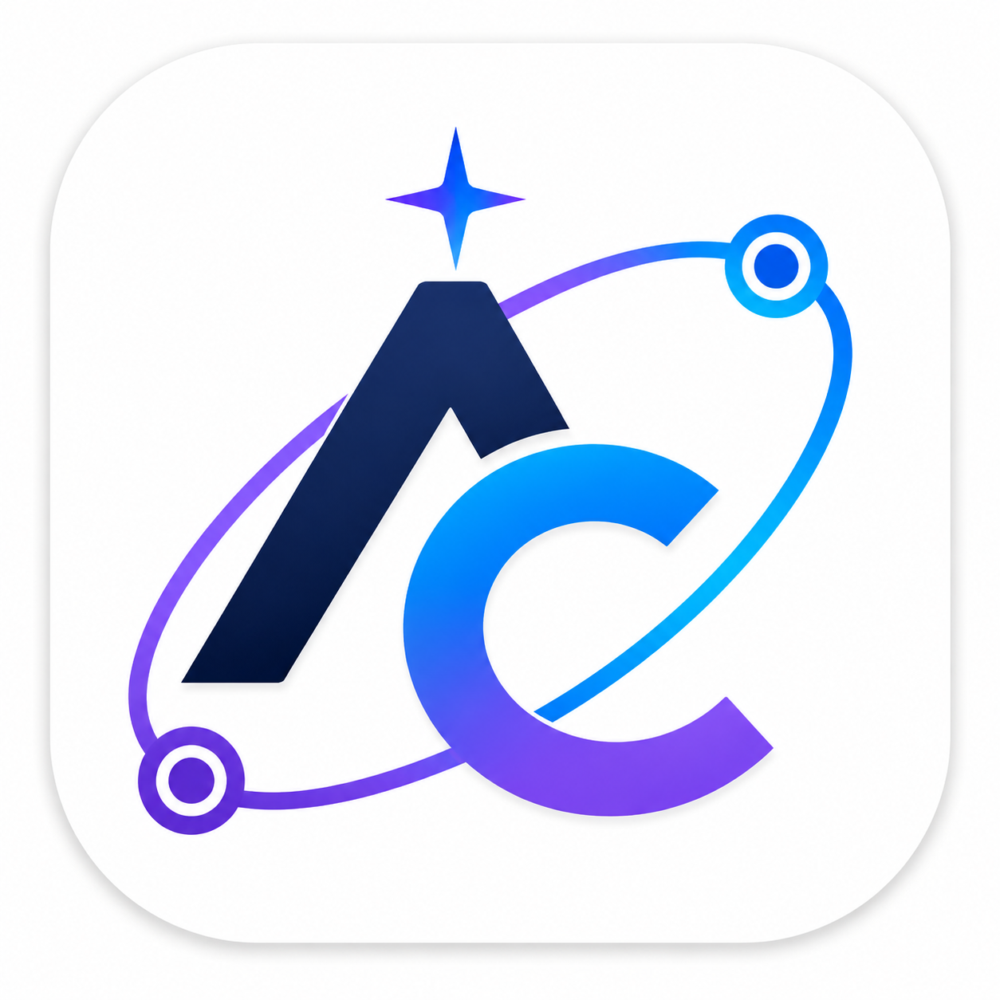

# ⚡ Arcturus Connexa

<div align="center">
  
  <h3>Next-Generation Professional Social & Career Networking Platform</h3>
  <p>
    A full-stack professional networking platform designed to connect developers, creators, and recruiters with real-time communication, multimedia feeds, interactive job listings, and frosted glassmorphic authentication.
  </p>

---

## 📑 Table of Contents

- [✨ Key Features](#-key-features)
- [🛠️ Tech Stack](#️-tech-stack)
- [📂 Project Architecture](#-project-architecture)
- [🚀 Getting Started](#-getting-started)
  - [Prerequisites](#prerequisites)
  - [Environment Setup](#environment-setup)
  - [Installation &amp; Running](#installation--running)
- [📡 API Endpoints Reference](#-api-endpoints-reference)
- [🎨 Themes &amp; UI Features](#-themes--ui-features)
- [🚢 Deployment](#-deployment)
- [📄 License](#-license)

---

## ✨ Key Features

### 1. 🔐 Modern Authentication & Security

- **Glassmorphism UI**: Frosted glass interface with high-contrast typography, floating inputs, and animated eye toggles.
- **EmailJS OTP Verification**: 4-step registration flow requiring a 6-digit one-time passcode with a 10-minute MongoDB TTL auto-expiry.
- **Secure Password Reset**: One-click reset links with time-limited JWT tokens and EmailJS integration.
- **Security & Authorization**: Bcrypt password hashing and JWT access token validation across protected endpoints.

### 2. 📰 Multimedia Feed & Networking

- **Rich Post Creation**: Text formatting, emojis, hashtags, and Cloudinary-powered image/media uploads.
- **Social Engagement**: Likes/reactions, nested comments, reposts, and social sharing.
- **Follow & Connection System**: Real-time connection requests with accept/ignore workflows.

### 3. 💼 Jobs Portal & Recruiter Management

- **Live MongoDB Jobs Marketplace**: Direct database-driven search, filtering by job title, location, employment type, and tech stack.
- **1-Click Apply**: Direct application submission with attached profile headline and candidate details.
- **Recruiter Account Portal**: Recruiter-exclusive dashboard to publish openings, customize company branding with preset logos, and close/delete active listings.

### 4. 💬 Real-Time Messaging & Floating Chat

- **Full Messaging Hub (`/messaging`)**: Split-view conversation drawer with multimedia attachment support and message search.
- **Floating Mini-Messenger Widget**: Persistent bottom-right chat widget allowing seamless multi-tasking across all pages.

### 5. 👤 Profile & Privacy Controls

- **Rich Profile Builder**: Interactive management of experience, education, certifications, skills, and portfolio projects.
- **Profile Analytics**: Track profile viewer count, search appearances, and post engagement analytics.
- **Visibility Modes**: Configurable public, semi-private, and private profile browsing modes.

### 6. 🎨 Dual Theme System (Light / Dark Mode)

- **Default Theme**: Clean, accessible Light Mode designed with professional contrast.
- **Dark Mode**: Dark theme with customized surfaces across feeds, forms, messaging, and empty states.
- **Preference Persistence**: Automatic `localStorage` theme state synchronization.

---

## 🛠️ Tech Stack

### Frontend

- **Framework**: [React 19](https://react.dev/) + [Vite](https://vitejs.dev/)
- **Routing**: [React Router DOM v7](https://reactrouter.com/)
- **Icons**: [React Icons (FontAwesome / Bootstrap Icons)](https://react-icons.github.io/react-icons/)
- **Styling**: Custom Vanilla CSS Modules + Bootstrap 5 + Glassmorphic Design Tokens
- **Client SDKs**: `@emailjs/browser`, `axios`

### Backend

- **Runtime**: [Node.js](https://nodejs.org/) (ES Modules)
- **Framework**: [Express 5](https://expressjs.com/)
- **Database**: [MongoDB Atlas](https://www.mongodb.com/atlas) via [Mongoose 9](https://mongoosejs.com/)
- **Authentication**: JSON Web Tokens (`jsonwebtoken`) + `bcrypt`
- **File & Media Storage**: [Cloudinary SDK](https://cloudinary.com/) + `multer`
- **Email Engine**: [EmailJS REST API](https://www.emailjs.com/)

---

## 📂 Project Architecture

```plaintext
arcturus/
├── public/                     # Static assets (logos, icons, background images)
│   ├── manifest.json           # Install as an app
│   ├── login.png               # Auth scenic backdrop image
│   └── logo.png                # Brand logo
├── server/                     # Express.js Backend API
│   ├── middleware/             # Authentication & validation middleware
│   │   └── auth.js
│   ├── models/                 # Mongoose schema models
│   │   ├── User.js             # User accounts & credentials
│   │   ├── Profile.js          # Profile attributes, experience, skills
│   │   ├── Post.js             # Feed posts, likes & comments
│   │   ├── Message.js          # Direct messages & conversations
│   │   ├── Job.js              # Job listings & applications
│   │   └── Otp.js              # Temporary OTP verification with TTL
│   ├── routes/                 # REST API endpoints
│   │   ├── auth.js             # Registration, login, OTP & password reset
│   │   ├── profile.js          # Profile queries & updates
│   │   ├── posts.js            # Post creation & engagement
│   │   ├── messages.js         # Conversation threads
│   │   └── jobs.js             # Job openings & recruiter operations
│   ├── templates/              # HTML Email Templates (EmailJS)
│   │   ├── passwordResetEmailTemplate.html
│   │   └── otpEmailTemplate.html
│   ├── utils/                  # Backend utilities
│   │   ├── email.js            # EmailJS API dispatcher
│   │   ├── cloudinary.js       # Cloudinary media uploader
│   │   ├── jwtUtils.js         # JWT signing & verification
│   │   └── passwordUtils.js    # Bcrypt hashing
│   ├── server.js               # Express application entry point
│   └── package.json
├── src/                        # React Frontend Application
│   ├── components/             # Reusable UI components
│   │   ├── auth/               # Login, Registration, Password Reset
│   │   ├── Home/               # Feed, Post Box, Right Sidebar, Messenger
│   │   ├── Header/             # Global navigation bar & search
│   │   └── Profile/            # Profile sections & modals
│   ├── context/                # Global React State Contexts
│   │   ├── AuthContext.jsx     # User session & token management
│   │   ├── ProfileContext.jsx  # Active user profile data
│   │   └── ThemeContext.jsx    # Light / Dark theme toggling
│   ├── pages/                  # Top-level Page Views
│   │   ├── AuthPage/           # Authentication hub
│   │   ├── FeedPage/           # Main activity feed
│   │   ├── JobsPage/           # Jobs discovery marketplace
│   │   ├── JobPostingPage/     # Recruiter job management portal
│   │   ├── MessegingPage/      # Full-page messaging center
│   │   ├── NotificationsPage/  # Activity & connection alerts
│   │   ├── ProfilePage/        # User portfolio & details
│   │   └── SettingsPage/       # Account & privacy preferences
│   ├── utils/                  # Client utilities & API builders
│   │   ├── api.js              # Base API URL helper
│   │   └── emailjs.js          # EmailJS client SDK wrapper
│   ├── darkmode.css            # Dark mode styles
│   ├── index.css               # Global base styles & CSS variables
│   ├── Router.jsx              # Application route tree
│   └── App.jsx
├── vite.config.js              # Vite bundler & API proxy configuration
└── package.json
```

---

## 🚀 Getting Started

### Prerequisites

- **Node.js**: `v18.0.0` or higher
- **npm**: `v9.0.0` or higher
- **MongoDB Atlas** cluster URL
- **Cloudinary** account (for media uploads)
- **EmailJS** account (for transactional OTP & password reset emails)

---

### Environment Setup

#### 1. Backend Environment Variables (`server/.env`)

Create a file named `.env` inside the `server/` directory:

```env
# Server Port & URLs
PORT=3000
CLIENT_URL=https://arcturus-connexa.vercel.app

# Database
MONGODB_URI=mongodb+srv://<username>:<password>@<cluster>.mongodb.net/arcturus?retryWrites=true&w=majority

# JWT Security
JWT_SECRET=your_super_secret_jwt_key
JWT_EXPIRES_IN=7d

# Cloudinary Media Storage
CLOUDINARY_CLOUD_NAME=your_cloud_name
CLOUDINARY_API_KEY=your_api_key
CLOUDINARY_API_SECRET=your_api_secret

# EmailJS Service Integration
EMAILJS_SERVICE_ID=service_xxxxxxx
EMAILJS_PUBLIC_KEY=your_public_key
EMAILJS_PRIVATE_KEY=your_private_key
EMAILJS_TEMPLATE_RESET_PASSWORD=template_xxxxxxx
EMAILJS_TEMPLATE_OTP=template_yyyyyyy
```

#### 2. Frontend Environment Variables (`.env`)

Create a file named `.env` in the project root:

```env
VITE_API_BASE_URL=http://localhost:3000/api
VITE_EMAILJS_PUBLIC_KEY=your_public_key
```

---

### Installation & Running

#### Step 1: Install Dependencies

```bash
# Install frontend dependencies
npm install

# Install backend dependencies
cd server
npm install
cd ..
```

#### Step 2: Start the Servers

```bash
# Terminal 1: Start Backend Server
cd server
npm start

# Terminal 2: Start Frontend Vite Dev Server
npm run dev
```

Visit **`http://localhost:5173`** in your browser to explore the platform.

---

## 📡 API Endpoints Reference

### 🔑 Authentication (`/api/auth`)

| Method   | Endpoint                            | Description                           | Auth Required |
| :------- | :---------------------------------- | :------------------------------------ | :-----------: |
| `POST` | `/api/auth/send-registration-otp` | Sends 6-digit OTP to email            |      ❌      |
| `POST` | `/api/auth/register`              | Verifies OTP and creates user account |      ❌      |
| `POST` | `/api/auth/login`                 | Authenticates user & issues JWT       |      ❌      |
| `POST` | `/api/auth/forgot-password`       | Dispatches password reset link        |      ❌      |
| `POST` | `/api/auth/reset-password`        | Resets password with token            |      ❌      |

### 💼 Jobs Marketplace (`/api/jobs`)

| Method     | Endpoint                  | Description                                                          | Auth Required |
| :--------- | :------------------------ | :------------------------------------------------------------------- | :-----------: |
| `GET`    | `/api/jobs`             | Retrieve all active openings (filters:`q`, `location`, `type`) |      ❌      |
| `GET`    | `/api/jobs/my-listings` | Get jobs published by authenticated recruiter                        |      ✅      |
| `GET`    | `/api/jobs/:id`         | Get details for a specific opening                                   |      ❌      |
| `POST`   | `/api/jobs`             | Publish a new job opening                                            |      ✅      |
| `POST`   | `/api/jobs/:id/apply`   | 1-Click apply to an opening                                          |      ✅      |
| `DELETE` | `/api/jobs/:id`         | Close and delete a job posting                                       |  ✅ (Owner)  |

### 📰 Feed & Posts (`/api/posts`)

| Method     | Endpoint                   | Description                           | Auth Required |
| :--------- | :------------------------- | :------------------------------------ | :-----------: |
| `GET`    | `/api/posts`             | Fetch paginated feed posts            |      ✅      |
| `POST`   | `/api/posts`             | Create new post with Cloudinary media |      ✅      |
| `POST`   | `/api/posts/:id/like`    | Like/react to a post                  |      ✅      |
| `POST`   | `/api/posts/:id/comment` | Add comment to a post                 |      ✅      |
| `DELETE` | `/api/posts/:id`         | Delete post                           |  ✅ (Author)  |

### 💬 Messaging (`/api/messages`)

| Method   | Endpoint                        | Description                       | Auth Required |
| :------- | :------------------------------ | :-------------------------------- | :-----------: |
| `GET`  | `/api/messages/conversations` | List conversation threads         |      ✅      |
| `GET`  | `/api/messages/:userId`       | Fetch chat history with user      |      ✅      |
| `POST` | `/api/messages/send`          | Send direct text or media message |      ✅      |

---

## 🎨 Themes & UI Features

- **Default Light Theme**: Clean white and soft slate design with high readability.
- **Full Dark Mode**: Dark slate/navy backgrounds (`#0f172a`, `#1e293b`) with neon blue accents.
- **Glassmorphism Auth**: Frosted translucent layers (`backdrop-filter: blur(24px)`) over scenic illustration backgrounds.

---

## 🚢 Deployment

### Deploy Backend to [Render](https://render.com)

1. Connect your GitHub repository to Render as a **Web Service**.
2. Set **Root Directory** to `server`.
3. Set **Build Command** to `npm install`.
4. Set **Start Command** to `npm start`.
5. Add all backend environment variables in the **Environment** tab.

### Deploy Frontend to [Vercel](https://vercel.com)

1. Import your GitHub repository into Vercel.
2. Set **Framework Preset** to `Vite`.
3. Add `VITE_API_BASE_URL=https://your-render-service.onrender.com/api`.
4. Deploy!

---

## 📄 License

This project available under the **MIT License**.

---

<div align="center">
  <b>Built with ❤️ by the Arcturus Team</b>
</div>
