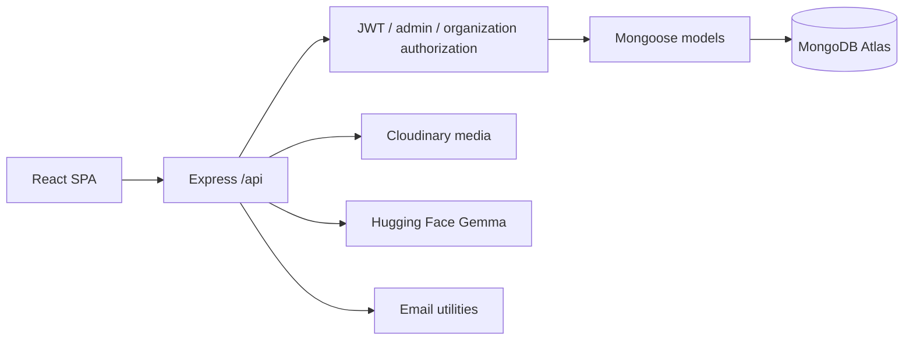
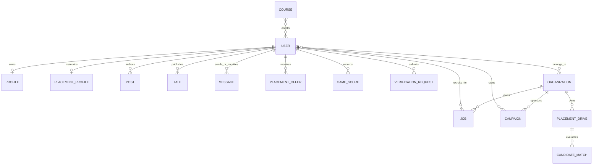
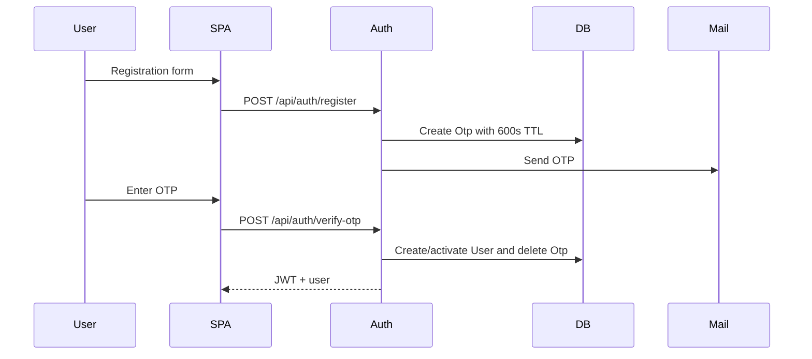
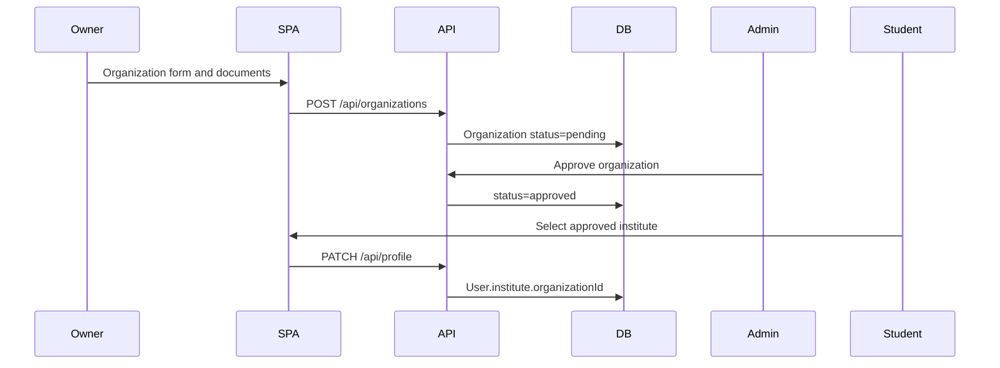
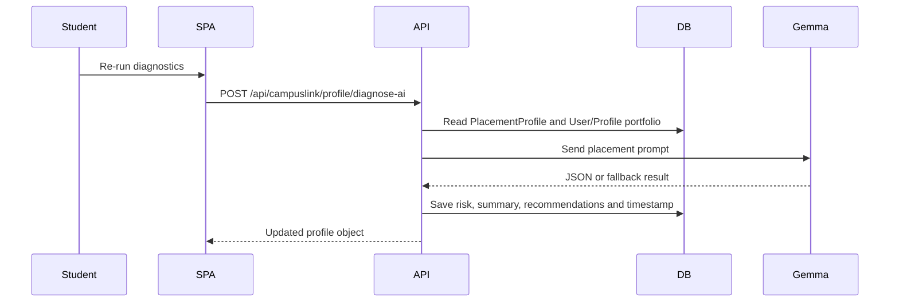
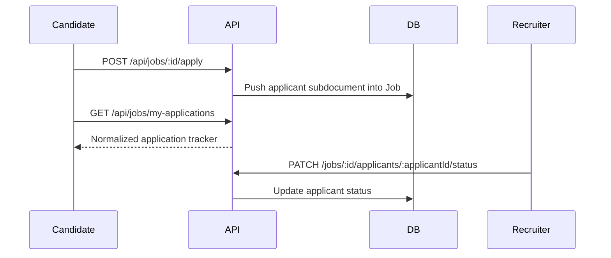

# Arcturus Connexa Database Schema and Dataflow

**Version:** 3.0.0 | **Reviewed:** 2026-09-19
**Source of truth:** `server/models/*.js`, `server/routes/**/*.js`, `server/db.js`
**Database:** MongoDB Atlas through Mongoose

This is the current schema reference. Field names and enum values below match the source implementation.

## 1. Persistence Architecture



- Connection bootstrap: `server/db.js`.
- Top-level models use Mongoose timestamps unless disabled.
- `Otp.createdAt` has a 600-second TTL.
- `Tale.expiresAt` has a 24-hour TTL.
- `Message.content` is transparently AES-256-CBC encrypted by a Mongoose setter/getter.
- Cloudinary stores media; MongoDB stores URL and `public_id` metadata.

## 2. All Database Models

### `User` - `server/models/User.js`

```text
_id: ObjectId
firstName: String required
middleName, lastName: String
email: String required, unique, lowercase, email pattern
username: String unique, lowercase, sparse
password: String required
 dateOfBirth: Date required
profilePicture: { url, public_id }
phoneNumber, location, headline: String
posts: [ObjectId -> User-owned Post]
activities: [{ activityType, postId -> Post, createdAt }]
profileViews: [{ viewerId -> User, viewedAt }]
profileViewsCount: Number
passwordHistory: [{ hash, createdAt }]
passwordResetToken, verificationToken: String
passwordResetExpires, lastLogin: Date
followers, following, connections: [ObjectId -> User]
pendingConnectionRequests, sentConnectionRequests: [ObjectId -> User]
organizations: [ObjectId -> Organization]
role: user | admin
isAdmin: Boolean
accountType: individual | student | recruiter | placement_officer | organization | admin
placementOfficer: { status: none | pending | approved | rejected,
                    organizationId -> Organization, statement, reviewedAt,
                    reviewedBy -> User, rejectionReason }
institute: { organizationId -> Organization, name, verified, studentId,
             graduationYear, department }
notifications: [{ type, message, fromUserId -> User, postId -> Post, read, createdAt }]
settings: { profileViewingMode, showEmailToConnections, shareProfileUpdates,
            twoFactorAuth, rememberSessions, emailNotifications, pushNotifications,
            soundEffects, autoplayVideos, theme, language }
```

Username generation runs in a pre-save hook when `username` is missing.

### `Profile` - `server/models/Profile.js`

```text
userId: ObjectId -> User, required, unique
name, headline, location, summary: String
backgroundImage, avatar: { url, public_id, resource_type }
featured: [{ title, subtitle, description, url }]
activity: [{ title, description, date, url }]
experience, education, certifications: [{ title, subtitle, location, dateRange, description, url, issuer }]
projects: [{ title, description, url, image, techStack: [String] }]
skills: [String]
honors: [{ title, issuer, date }]
interests: [String]
```

### `Organization` - `server/models/Organization.js`

```text
name: String required, unique, trim
slug: String required, unique, lowercase
 tagline, description, website, location: String
industry: String required
organizationSize: 1-10 | 11-50 | 51-200 | 201-500 | 501-1000 | 1000+
organizationType: Privately Held | Public Company | Startup | Government Agency |
                  Nonprofit | Sole Proprietorship | Partnership
logo: { url, public_id }
documents: [{ url required, public_id, documentType, originalName, uploadedAt }]
adminId: ObjectId -> User required
status: pending | approved | rejected
rejectionReason: String
reviewedAt: Date
reviewedBy: ObjectId -> User
members: [{ userId -> User, role: Admin | Recruiter | Placement Officer | Member, joinedAt }]
followers: [ObjectId -> User]
```

### `Post` - `server/models/Post.js`

```text
userId: ObjectId -> User required
author, content: String
audience: Anyone | Connections only | Group | Only me
media: [{ url required, public_id, resource_type }]
poll: { question, options: [{ text, votes: [User] }], duration, expiresAt }
event: { title, date, time, isOnline, location }
celebration: { type, recipientName, message }
hiring: { role, company, location, applyUrl }
document: { url, name, size, public_id }
isScheduled: Boolean
scheduledAt: Date
likes: [{ userId -> User, reactionType }]
comments: [{ userId -> User, content, createdAt }]
impressions: [{ viewerId -> User, viewedAt }]
impressionsCount: Number
repostedFrom: ObjectId -> Post
```

### `Message` - `server/models/Message.js`

```text
senderId: ObjectId -> User required
receiverId: ObjectId -> User required
content: String required, stored as <hex_iv>:<hex_ciphertext>
read: Boolean default false
createdAt, updatedAt: timestamps
```

### `Job` - `server/models/Job.js`

```text
title, company, location, description: String required
companyLogo: String
workplaceType: On-site | Hybrid | Remote
employmentType: Full-time | Part-time | Contract | Internship
salary: String
skills: [String]
organizationId: ObjectId -> Organization
recruiterId: ObjectId -> User
applicants: [{ applicantId -> User, name, email, headline, appliedAt,
               status: Applied | In Review | Shortlisted | Rejected | Hired }]
isActive: Boolean default true
```

### `Course` - `server/models/Course.js`

```text
title, description: String required
slug: String
category: Communication | Cloud & DevOps | AI & Machine Learning |
         Full Stack Development | System Design | Leadership & Management | Data Engineering
level: Beginner | Intermediate | Advanced | All Levels
duration: String
rating: Number 1-5
reviewsCount, learnersCount: Number
thumbnail: String
instructor: { name, role, avatar }
skills: [String]
modules: [{ title, lessons: [{ title required, duration, videoUrl, summary }] }]
enrolledUsers: [{ userId -> User, progress, completedLessons, enrolledAt, completedAt, certificateId }]
```

### `Campaign` - `server/models/Campaign.js`

```text
name: String required
organizationId -> Organization
organizationName: String required
organizationLogo: String
userId -> User required
objective: brand_awareness | website_visits | job_promotion | lead_generation
targetIndustry, targetLocation: String
placement: feed | sidebar | both
headline, description: String required
mediaUrl, callToAction, destinationUrl: String
dailyBudget, totalBudget: Number
status: active | paused | completed
metrics: { impressions, clicks, spend }
```

### `PlacementProfile` - `server/models/PlacementProfile.js`

```text
userId: ObjectId -> User required, unique
rollNumber, collegeName: String required
branch: Computer Science & Engineering | Information Technology |
       Electronics & Communication | Electrical & Electronics | Mechanical Engineering | Civil Engineering
graduationYear: Number
cgpa: Number required, 0-10
activeBacklogs, totalBacklogs: Number
tenthPercentage, twelfthPercentage: Number
skills, targetRoles: [String]
technicalScore, aptitudeScore, communicationScore, projectScore: Number
overallReadiness: Number computed before save
readinessLevel: Not Ready | Developing | Ready | Highly Employable
aiReadinessSummary: String
skillGaps: [{ targetRole, missingSkills, matchedSkills, matchPercentage, recommendation,
              suggestedCourses: [{ title, provider, url }] }]
placementStatus: unplaced | shortlisted | interviewing | placed | opted_out
isAtRisk, riskReason: Boolean/String
assignedMentor, mentorActionRecommendation: String
gemmaDiagnosticTimestamp, lastAssessmentDate: Date
gemmaModel, gemmaProvider: String
mockInterviewsTaken: Number
```

Readiness is computed as `0.35*technical + 0.25*aptitude + 0.20*communication + 0.20*project`.

### `PlacementDrive` - `server/models/PlacementDrive.js`

```text
organizationId: ObjectId -> Organization, optional for legacy drives
companyName, roleTitle, description: String required
companyLogo: String
jobCategory: Core Software | Cloud & DevOps | FinTech & Analytics |
             AI & Data Science | Product Engineering
ctcLpa, baseStipend: Number
packageTier: Standard (< 6 LPA) | Dream (6 - 12 LPA) | Super Dream (> 12 LPA)
eligibility: { minCgpa, maxBacklogs, allowedBranches, requiredSkills, minReadinessScore }
schedule: { driveDate required, startTime, endTime, venue, isVirtual, virtualMeetingUrl, slotId }
stages: [{ name required, date, time, venue, status: upcoming | ongoing | completed }]
candidates: [{ userId, studentName required, studentEmail, rollNumber, branch, cgpa,
               fitScore, fitRationale, isEligible, eligibilityNotes,
               status, currentStage }]
status: upcoming | ongoing | completed | cancelled
totalOpenings, offersExtended: Number
```

`packageTier` is derived from `ctcLpa` in a pre-save hook. New officer-created drives must be linked to the officer's approved organization.

### `PlacementOffer` - `server/models/PlacementOffer.js`

```text
studentId -> User required
studentName, rollNumber, branch, companyName, role: required strings
companyLogo: String
ctcLpa: Number required
packageTier: Standard | Dream | Super Dream
offerType: Full-Time | Internship + PPO | Internship Only
offerDate, acceptanceDeadline, joiningDate: Date
status: offered | accepted | deferred | declined
verificationStatus: pending | verified | rejected
documentUrl, bondDetails: String
verificationHash: generated integrity hash
```

### `VerificationRequest` - `server/models/VerificationRequest.js`

```text
userId -> User required, indexed
fullName: String required
category: Student / Scholar | Academic / Researcher | Software Engineer / Tech |
          Creator / Thought Leader | Executive / Business Leader |
          Organization Representative | Public Figure
affiliation: String required
organizationId -> Organization
evidenceUrl, reason, adminNotes: String
status: pending | approved | rejected, indexed
reviewedBy -> User
reviewedAt: Date
```

### `Tale` - `server/models/Tale.js`

```text
userId -> User required
media: { url, public_id, resource_type }
text, caption, background, textColor, fontFamily: String
viewers: [{ userId -> User, viewedAt }]
reactions: [{ userId -> User, reaction, createdAt }]
comments: [{ userId -> User, content, createdAt }]
expiresAt: Date with 24-hour TTL
```

### `Otp` - `server/models/Otp.js`

```text
email: String required, lowercase, trim, indexed
otp: String required
purpose: registration | password_reset | login
createdAt: Date with 600-second TTL
```

### `GameLevel` and `GameScore` - `server/models/Game.js`

```text
GameLevel: gameKey, levelNumber, puzzleNumber, title, difficulty, puzzleData, solutionMeta
GameScore: userId -> User, gameKey, levelNumber, puzzleNumber, timeSeconds, moves, completedAt
```

## 3. Relationships



Arrays such as job applicants, organization members, post comments, course enrollments and drive candidates are embedded subdocuments. The remaining relationships use ObjectId references and route-level `populate()` calls.

## 4. Dataflows

### Authentication



### Organization and institute badge



### Placement Officer and organization drives

```mermaid
sequenceDiagram
 User->>API: POST /api/campuslink/officers/apply
 API->>DB: User.placementOfficer.status=pending
 Admin->>API: POST /admin/applications/:userId/approve
 API->>DB: accountType=placement_officer; member role=Placement Officer
 Officer->>API: POST /api/campuslink/drives
 API->>DB: Verify approved linked Organization
 API->>DB: Save PlacementDrive.organizationId
 Officer->>API: GET /drives/:id/match
 API->>DB: Filter User.institute.organizationId to drive organization
 API-->>Officer: Explainable candidate ranking
```

### Gemma diagnostic



### Job application



## 5. Authorization Matrix

| Operation                               | Required authority                                             |
| --------------------------------------- | -------------------------------------------------------------- |
| Apply to job                            | Authenticated user                                             |
| Manage personal applications            | Authenticated applicant                                        |
| Create/manage job listing               | Approved linked organization member                            |
| Apply for Placement Officer             | Authenticated user linked to approved organization             |
| Approve/reject Placement Officer        | Arcturus Admin                                                 |
| Create/update/delete organization drive | Arcturus Admin or approved linked organization manager/officer |
| View organization candidate matching    | Arcturus Admin or authorized drive organization                |
| Candidate included in officer matching  | `User.institute.organizationId` matches organization         |
| Organization approval and admin metrics | Arcturus Admin                                                 |

## 6. Migration and Security Notes

- Legacy `PlacementDrive` records can have no `organizationId`; backfill them before organization-level management.
- The scheduling form supports custom branch strings in `eligibility.allowedBranches`; `PlacementProfile.branch` retains its current enum.
- `Message` requires a strong production `ENCRYPTION_KEY`; the model fallback is development-only.
- Never commit `server/.env`, tokens, database URLs or cloud credentials.
