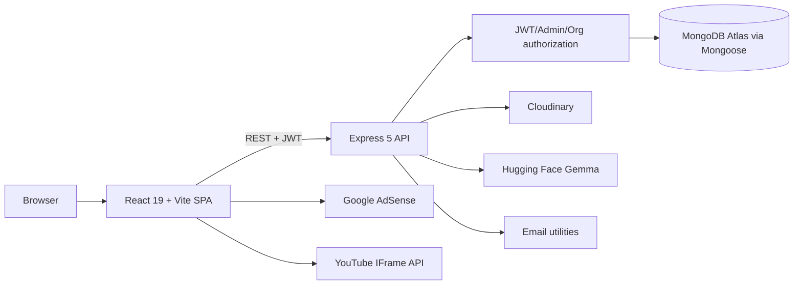
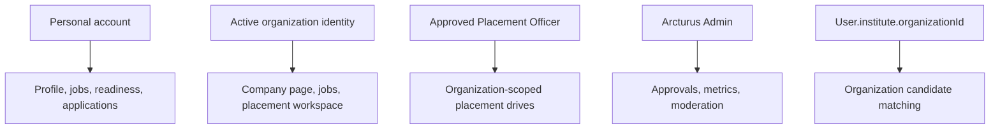

# Arcturus Connexa Project Design Document

**Version:** 3.0.0  
**Reviewed:** 2026-09-19  
**Repository:** `arcturus/`

This document describes the current frontend, backend, runtime, authorization, folder architecture and file inventory. The complete database field reference is in [`DATABASE_SCHEMA_DATAFLOW.md`](DATABASE_SCHEMA_DATAFLOW.md).

## 1. Architecture Overview



The repository is a monorepo-style application with an npm frontend package at the root and an npm backend package under `server/`. The client is a browser SPA; the backend is an Express micro-monolith with modular route files and Mongoose models.

## 2. Root Tree

```text
arcturus/
├── .gitignore
├── cred.txt                         # Sensitive local credential note; do not publish
├── eslint.config.js
├── index.html                       # Vite shell and AdSense loader
├── LICENSE
├── package.json / package-lock.json
├── README.md
├── render.yaml / vercel.json / vite.config.js
├── SECURITY.md / TODO.md
├── public/                          # favicon.png, login.png, logo.png, manifest.json
├── docs/                            # PDD, database schema, PRD, overview, manual
├── scratch/                         # Local seed/fetch experiments
├── server/                          # Express/Mongoose application
├── src/                             # React application
└── dist/                            # Generated Vite output; do not edit
```

## 3. Backend Architecture

```text
server/
├── .env
├── db.js
├── package.json / package-lock.json
├── render.yaml
├── server.js
├── middleware/
│   ├── admin.js
│   └── auth.js
├── models/
│   ├── Campaign.js
│   ├── Course.js
│   ├── Game.js
│   ├── Job.js
│   ├── Message.js
│   ├── Organization.js
│   ├── Otp.js
│   ├── PlacementDrive.js
│   ├── PlacementOffer.js
│   ├── PlacementProfile.js
│   ├── Post.js
│   ├── Profile.js
│   ├── Tale.js
│   ├── User.js
│   └── VerificationRequest.js
├── routes/
│   ├── admin.js, ads.js, auth.js, campuslink.js, games.js, index.js
│   ├── jobs.js, learning.js, messages.js, news.js, notifications.js
│   ├── organizations.js, posts.js, profile.js, search.js, tales.js
│   ├── users.js, verification.js
│   └── campuslink/
│       ├── analyticsRoutes.js
│       ├── assistantRoutes.js
│       ├── drivesRoutes.js
│       ├── helpers.js
│       ├── index.js
│       ├── offersRoutes.js
│       ├── officerRoutes.js
│       └── profileRoutes.js
├── scripts/
│   ├── assignUsernames.js
│   └── seedJobs.js
├── services/gemmaService.js
├── templates/
│   ├── otpEmailTemplate.html
│   └── passwordResetEmailTemplate.html
└── utils/
    ├── cloudinary.js
    ├── conflictDetector.js
    ├── email.js
    ├── jwtUtils.js
    └── passwordUtils.js
```

### Backend responsibilities

- `server.js`: loads environment, configures CORS/body parsers, connects MongoDB, mounts `/api`, exposes `/health`.
- `middleware/auth.js`: validates Bearer JWT and provides `req.userId`.
- `middleware/admin.js`: restricts admin routes.
- `routes/index.js`: mounts all domain routers.
- `models/`: defines all 15 Mongoose model files; see the database document for exact nested fields.
- `services/gemmaService.js`: one bounded Hugging Face chat request plus placement-analysis and domain fallback logic.
- `utils/`: infrastructure helpers for media, conflict detection, email, JWT and passwords.

## 4. API Mounts

| Mount | Files | Function |
|---|---|---|
| `/api/auth` | `auth.js` | Registration, login, OTP, reset |
| `/api/users` | `users.js` | User operations and network |
| `/api/profile` | `profile.js` | Professional profile and institute link |
| `/api/posts` | `posts.js` | Feed and social interactions |
| `/api/messages` | `messages.js` | Encrypted conversations |
| `/api/notifications` | `notifications.js` | Notifications |
| `/api/news` | `news.js` | News content |
| `/api/jobs` | `jobs.js` | Jobs, applications, recruiter ATS |
| `/api/organizations` | `organizations.js` | Company pages, followers, approval data |
| `/api/learning` | `learning.js` | Courses, lessons and progress |
| `/api/ads` | `ads.js` | Campaigns and ad metrics |
| `/api/games` | `games.js` | Puzzle levels and scores |
| `/api/tales` | `tales.js` | Stories and interactions |
| `/api/search` | `search.js` | Unified search |
| `/api/verification` | `verification.js` | Blue-tick verification |
| `/api/admin` | `admin.js` | Admin metrics, moderation, approvals |
| `/api/campuslink` | `campuslink.js` + subroutes | Placement engine, officer workflow and Gemma |

## 5. Frontend Architecture

```text
src/
├── main.jsx, App.jsx, Router.jsx
├── App.css, index.css, darkmode.css, mobile.css
├── NotFound.jsx / NotFound.css
├── assets/
├── context/
│   ├── AuthContext.jsx
│   ├── ProfileContext.jsx
│   ├── ReactionContext.jsx
│   └── ThemeContext.jsx
├── hooks/useMediaQuery.js
├── utils/api.js, emailjs.js, user.js
├── components/
│   ├── admin/                         # AdminMetrics, CourseManagement, moderation, approvals
│   ├── auth/                          # Login, Registration, ForgotPassword, ResetPassword
│   ├── CampusLink/                    # Hero, tabs, readiness, drives, matching, offers, AI, modal
│   ├── common/BackToTop/              # BackToTop component and CSS
│   ├── Games/                         # Six puzzle components, game modal and styles
│   ├── Home/
│   │   ├── Feed/                      # Feed, create post, sorting, post card/modal, sponsored card
│   │   ├── Messenger/                 # Conversations, search, chat window, composer
│   │   ├── Sidebar/                   # Profile, analytics, company, quick links, SidebarAd
│   │   └── RightSidebar/              # News, games, ads, footer links/modals
│   ├── Navbar/                        # Navbar, left/center/right controls, mobile drawer
│   ├── Profile/                       # Profile display, network, editor and section editors
│   ├── Tale/                          # Tale tray, create modal and viewer
│   └── UnderConstruction/             # Legacy fallback view
└── pages/
    ├── ActivityPage/
    ├── AdvertisePage/
    ├── AuthPage/
    ├── CampusLink/
    ├── CompanyPage/
    ├── HelpPage/
    ├── HomePage/
    ├── InfoPage/                      # Real About, Accessibility, Ad Choices, App, More pages
    ├── JobPostingPage/
    ├── JobsPage/
    ├── Learning/
    ├── MessegingPage/
    ├── NetworkPage/
    ├── NotificationsPage/
    ├── PostPage/
    ├── ProfileEditPage/
    ├── ProfilePage/
    ├── SearchPage/
    ├── SettingsPage/
    └── admin/
```

### Exact frontend route map

| Route | Component | Purpose |
|---|---|---|
| `/` | `HomePage/Home.jsx` | Feed and dashboards |
| `/login`, `/register`, `/forgot-password`, `/reset-password` | `AuthPage/AuthPage.jsx` | Public auth |
| `/profile`, `/profile/:username` | `ProfilePage/ProfilePage.jsx` | Profile |
| `/profile/edit`, `/profile/:username/edit` | `ProfileEditPage/ProfileEditPage.jsx` | Profile editor |
| `/profile/activity`, `/profile/:username/activity` | `ActivityPage/ActivityPage.jsx` | Activity |
| `/network`, `/mynetwork` | `NetworkPage/NetworkPage.jsx` | Network |
| `/messaging` | `MessegingPage/MessegingPage.jsx` | Messaging |
| `/notifications` | `NotificationsPage/NotificationsPage.jsx` | Notifications |
| `/search` | `SearchPage/SearchPage.jsx` | Search |
| `/jobs` | `JobsPage/JobsPage.jsx` | Candidate jobs |
| `/jobs/manage`, `/jobs/post`, `/recruiter/dashboard` | `JobPostingPage/JobPostingPage.jsx` | Organization recruiter portal |
| `/company/create` | `JobPostingPage/JobPostingPage.jsx` | Organization registration |
| `/company/:idOrSlug`, `/organization/:idOrSlug` | `CompanyPage/CompanyPage.jsx` | Company page |
| `/campuslink` | `CampusLinkPage/CampusLinkPage.jsx` | Personal or organization CampusLink |
| `/learning` | `LearningHubPage/LearningHubPage.jsx` | Learning |
| `/advertise` | `AdvertisePage/AdvertisePage.jsx` | Advertising |
| `/settings/*` | `SettingsPage/SettingsPage.jsx` | Settings, applications, verification, officer application |
| `/help`, `/help-support` | `HelpPage/HelpPage.jsx` | Help |
| `/about`, `/accessibility`, `/ad-choices`, `/app`, `/more` | `InfoPage/InfoPage.jsx` | Footer information pages |
| `/admin` | `admin/AdminDashboard.jsx` | Admin operations |

## 6. Identity and Dataflow



1. `AuthContext` persists JWT/user/organizations and the active identity.
2. The UI hides recruiter actions for personal identities, but backend route authorization is authoritative.
3. A user applies for Placement Officer access from Settings.
4. Arcturus Admin approves the application, sets `accountType=placement_officer`, and adds the organization member role.
5. Approved organization managers/officers create drives with `PlacementDrive.organizationId`.
6. Candidate matching filters normal users whose `User.institute.organizationId` matches the drive organization.
7. Gemma reads `PlacementProfile` plus the full `User/Profile` portfolio, stores diagnostics, and returns the updated profile to the SPA.

## 7. External Services

| Service | Source | Environment/use |
|---|---|---|
| MongoDB Atlas | `server/db.js` | `MONGODB_URI` |
| Cloudinary | `server/utils/cloudinary.js` | Organization/profile/post media |
| Hugging Face Gemma | `server/services/gemmaService.js` | `HF_TOKEN`, `google/gemma-3-4b-it` |
| Email | `server/utils/email.js` | OTP and password reset |
| EmailJS browser client | `src/utils/emailjs.js` | Auth email helpers |
| Google AdSense | `index.html`, `SidebarAd.jsx` | Sidebar advertising slot |
| YouTube IFrame | `LearningHubPage.jsx` | Lesson playback/watch tracking |

## 8. Local Commands

```powershell
npm install
npm run dev
npm run build

cd server
npm install
npm start
node --check routes/campuslink/drivesRoutes.js
```

Do not publish `server/.env`, credentials, JWT secrets, database URLs, Cloudinary secrets or Hugging Face tokens.
