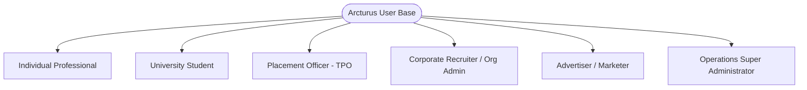
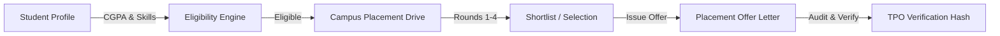

# Product Requirements Document (PRD)
## Project: Arcturus Connexa — The Unified Professional, Enterprise & Academic Ecosystem
**Document Version:** 2.4.0  
**Product Status:** Active / In Production  
**Target Environment:** Web (Desktop, Tablet, Mobile Responsive PWA-ready)  
**Classification:** Proprietary / Engineering & Product Specification  

---

## 1. Executive Summary & Vision Statement

### 1.1 Executive Summary
**Arcturus Connexa** (commonly referenced as **Arcturus**) is an enterprise-grade, multi-tenant digital ecosystem combining professional social networking, university campus recruitment, corporate applicant tracking, accredited e-learning masterclasses, gamified cognitive training, and a native programmatic advertising network into a single, cohesive web platform.

Traditional platforms segregate professional identity (e.g., LinkedIn), university placement drives (e.g., Superset, Handshake), online learning (e.g., Coursera), and cognitive assessments into fragmented silos. Arcturus bridges these domains, providing a continuous lifecycle from undergraduate academic enrollment to executive corporate leadership.

### 1.2 Vision Statement
To establish the world's most transparent, high-trust professional network where academic credentials, active skill acquisition, verified business identities, and real-time career opportunities seamlessly intersect.

---

## 2. Target Market & User Personas

Arcturus serves six distinct user classes, each with customized privilege boundaries and tailored workflows:

### 2.1 Persona Matrix

| Persona Class | Primary Motivation | Key Features Leveraged | Access Level |
| :--- | :--- | :--- | :--- |
| **Individual Professional** | Career advancement, knowledge sharing, networking | Feed, Messaging, Jobs, Tales, Masterclasses, Games | Standard Auth (`role: user`, `accountType: individual`) |
| **University Student** | Campus placement readiness, corporate job offers | CampusLink Student Portal, AI Readiness, Drive Applications | Verified Student (`accountType: student`) |
| **Training & Placement Officer (TPO)** | University placement metrics, scheduling corporate drives | CampusLink Admin, Drive Management, Offer Approval, Batch Analytics | Verified Officer (`accountType: placement_officer`) |
| **Corporate Recruiter / Org Admin** | Talent acquisition, business brand presence | Organization Page, Document Verification, Job Postings, ATS Pipeline | Organization Admin/Recruiter (`role: Admin/Recruiter`) |
| **Advertiser / Marketer** | Lead generation, brand awareness, job promotion | Arcturus Ads Manager, Campaign Builder, Analytics Dashboard | Self-Serve Advertiser (`accountType: individual/organization`) |
| **Operations Super Admin** | Platform security, trust compliance, system oversight | Admin Operations Hub, Org Review Lightbox, Course CMS, Moderation | Root Administrator (`role: admin`, `isAdmin: true`) |

---

## 3. Comprehensive Feature Specifications (Epic Breakdown)

---

### EPIC 1: Identity, Authentication & Security

#### 1.1 User Registration & Verification
- **Functional Requirements:**
  - Standard registration requiring First Name, Last Name, Email, Password, and Date of Birth (must be $\ge 16$ years old).
  - Automated 6-digit numeric OTP generation sent via SMTP/Nodemailer to user's registered email with a strict 10-minute TTL index (`server/models/Otp.js`).
  - Secure password hashing using `bcryptjs` with salt rounds $\ge 10$.
  - Enforced password history tracking (`passwordHistory` array of hashes) preventing reuse of the last 3 passwords.
  - Unique username generation with slug validation and audit history tracking (`usernameChangeHistory`).
- **Backend API Endpoints:**
  - `POST /api/auth/register` — Initial credential registration and OTP dispatch.
  - `POST /api/auth/verify-otp` — Validation of OTP and account activation (`isVerified = true`).
  - `POST /api/auth/resend-otp` — Throttled OTP regeneration.
  - `POST /api/auth/login` — Credential validation and JWT token issuance.
  - `POST /api/auth/forgot-password` & `POST /api/auth/reset-password` — Secure recovery lifecycle.

#### 1.2 Session Management & RBAC
- Stateless JSON Web Tokens (JWT) containing `{ userId, role, accountType }` with 7-day expiration.
- Custom middleware layers:
  - `authMiddleware` — Authenticates incoming Bearer JWT on protected routes.
  - `adminMiddleware` — Enforces strict admin authorization checking database flag `isAdmin: true` or `role: admin`.
  - `officerMiddleware` — Guards academic endpoints to verified Placement Officers.

---

### EPIC 2: Professional Social Networking & Activity Stream

#### 2.1 Post Authoring & Multimedia Distribution
- Rich multimedia posting supporting:
  - Markdown-style text content and hashtags.
  - Media uploads (photos/videos via Cloudinary CDN).
  - Interactive Polls (custom questions, up to 4 options, configurable duration, real-time vote distribution).
  - Celebration Cards (Kudos, promotions, work anniversaries).
  - Event Announcements (Date, time, virtual meeting URL or physical location).
  - Document Attachments (PDFs, presentations, project briefs).
  - Audience visibility rules (`Anyone`, `Connections only`, `Group`, `Only me`).
- **Social Engagement:**
  - 6-tier reaction engine (Like, Celebrate, Support, Love, Insightful, Funny).
  - Multi-level nested comments with user tagging and real-time deletion.
  - Instant reposts and quote reposts with attribution.

---

### EPIC 3: Ephemeral Tales (Stories Engine)

- 24-hour time-to-live (TTL) multimedia stories.
- Image and text support with interactive sticker captions and font styling.
- Real-time viewer tracking displaying exact timestamps of connection impressions.
- Story reactions and direct inline private reply messaging.
- MongoDB TTL expiration indexes automatically purging expired tales after 86,400 seconds.

---

### EPIC 4: Direct Messaging & End-to-End Database Encryption

- One-on-one direct messaging with real-time delivery and polling fallback.
- **Security Standard:** All message payloads are encrypted at rest using AES-256-CBC with dynamic initialization vectors (`server/models/Message.js`). Unencrypted text is never stored in persistent MongoDB storage.
- Real-time read receipt tracking (`read: Boolean`, `readAt: Date`).
- Global unread message counter badge integrated in the top navigation bar.

---

### EPIC 5: Verified Organizations & Multi-Tenant Enterprise Hub

#### 5.1 Organization Lifecycle & Document Verification
- Self-serve company page creation (Name, slug, industry, company size, website, headquarters).
- Mandatory legal document verification workflow:
  - Upload of Certificate of Incorporation, Business License, or Tax ID (GST/VAT).
  - Status progression: `pending` $\rightarrow$ `approved` OR `rejected`.
  - Rejection feedback engine: Admins select preset reasons or provide custom guidance; organization admins can re-upload corrected documents without recreating the profile.
- Multi-member organizational roles: `Admin`, `Recruiter`, `Placement Officer`, `Member`.

---

### EPIC 6: CampusLink — Academic Placement & Career Operating System

#### 6.1 Placement Candidate Profiles
- Academic tracking: College Name, Degree, Branch, Roll Number, Graduation Year, CGPA ($0.0 - 10.0$), active backlogs, total backlogs, 10th and 12th percentages.
- **4-Dimension Readiness Matrix (0–100):**
  $$\text{Overall Readiness} = 0.35 \times \text{Tech} + 0.25 \times \text{Aptitude} + 0.20 \times \text{Comm} + 0.20 \times \text{Project}$$
- **Readiness Tiers:**
  - $\ge 85$: `Highly Employable`
  - $70 - 84$: `Ready`
  - $50 - 69$: `Developing`
  - $< 50$: `Not Ready`
- **Predictive At-Risk Diagnostics:** Integrates Google Gemma 3 4B-IT (`google/gemma-3-4b-it`) via Hugging Face Inference to analyze skill deficiencies and automatically recommend personalized remedial masterclasses.

#### 6.2 Placement Drive Scheduling & Management
- Multi-stage placement drives:
  - Company credentials, CTC in LPA (Tier classification: Standard $< 6$ LPA, Dream $6-12$ LPA, Super Dream $> 12$ LPA).
  - Automated eligibility filtering: Filters candidates instantly based on minimum CGPA, maximum allowed active backlogs, and allowed academic branches.
  - Stage tracking: Pre-Placement Talk $\rightarrow$ Online Aptitude $\rightarrow$ Technical Interview $\rightarrow$ HR Round $\rightarrow$ Final Selection.

#### 6.3 Placement Offer Verification
- Digital offer tracking with automated cryptographic SHA-256 verification hash.
- Acceptance deadline counters and bond policy disclosure.

---

### EPIC 7: Enterprise Job Portal & Applicant Tracking System (ATS)

- Full-featured job posting engine for verified organizations.
- Filtering by Workplace Type (`On-site`, `Hybrid`, `Remote`) and Employment Type (`Full-time`, `Part-time`, `Contract`, `Internship`).
- Applicant screening dashboard with status management: `Applied` $\rightarrow$ `In Review` $\rightarrow$ `Shortlisted` $\rightarrow$ `Rejected` $\rightarrow$ `Hired`.
- Direct one-click application with Arcturus profile and attached resume.

---

### EPIC 8: Learning Hub — Accreditation-Grade Masterclasses

#### 8.1 Curriculum & Masterclass Catalog
- Deep-dive communication and leadership masterclasses curated from Vinh Giang (`@askvinh`):
  1. *The Art of Communication: Vocal Mastery, Influence & Stage Presence*
  2. *Effortless Conversation & Subtext Listening Masterclass*
  3. *Executive Influence, Likability & Difficult Conversations*
  4. *The CLEAR Explaining Framework & Complex Storytelling*

#### 8.2 Interactive Video Player & Strict Anti-Cheat Progress Engine
- YouTube IFrame API integration with complete custom controls deck:
  - Play / Pause, Rewind 10s, Forward 10s, Speed selector ($0.75\times$ to $2\times$), Lesson selector.
- **Anti-Cheat Verification Algorithm:**
  - Tracks unique active watch seconds in memory (`Set` accumulator).
  - Fast-forwarding, scrubbing, or jumping to the end **does not** advance verified completion.
  - Milestone enforcement: Mark Complete is strictly disabled until the learner achieves $\ge 80\%$ genuine watch time.
  - Automated certificate generation with unique verification ID upon completing 100% of curriculum modules.

---

### EPIC 9: Arcturus Games & Cognitive Brain Training

- Six integrated daily cognitive mini-games:
  1. **Sudoku** (Algorithmic number logic)
  2. **Zip** (Pathfinding connection puzzle)
  3. **Tango** (Binary constraint grid)
  4. **Queens** (Chess-inspired placement logic)
  5. **Crossclimb** (Vocabulary word ladder)
  6. **Pinpoint** (Category deductive reasoning)
- Daily puzzle tracking, move counters, timer recording, and global leaderboard rankings.

---

### EPIC 10: Native Targeted Ad Exchange (Arcturus Ads)

- Self-serve campaign manager:
  - Objectives: `Brand Awareness`, `Website Visits`, `Job Promotion`, `Lead Generation`.
  - Targeting: Industry verticals, geographic locations, and placement slots (`feed`, `sidebar`, `both`).
  - Budgeting: Total budget cap, daily pacing, and Cost-Per-Click (CPC) / Cost-Per-Mille (CPM) calculation.
- Fallback integration: Responsive Google AdSense slots with minimum width guardrails ($250\text{px}$) to prevent tag errors.

---

### EPIC 11: Centralized Operations Hub (Admin Dashboard)

- High-security operations interface accessible only to Arcturus Super Administrators.
- **Real-Time Platform KPI Deck:** Total Organizations, Pending Verifications, Active Jobs, Total Users, Total Masterclasses, and Enrolled Learners.
- **Organization Audit Suite:** Document preview with lightbox, approved/reject action toggles, and preset rejection reason templates.
- **Course CMS:** Full CRUD suite for masterclass courses, module sequencing, lesson creation, and YouTube URL sanitization.

---

## 4. Non-Functional Requirements (NFRs)

### 4.1 Performance & Latency
- First Contentful Paint (FCP) $< 1.2\text{s}$ on broadband networks.
- Client build bundled with code-splitting via Rollup/Vite ensuring initial chunk sizes stay optimal.
- MongoDB Atlas operations guarded by query indexing on frequently searched fields (`email`, `username`, `slug`, `status`, `userId`).

### 4.2 Security & Compliance
- Passwords salted with bcrypt ($10$ rounds).
- Private messages protected by AES-256-CBC cipher with dynamic initialization vectors.
- Cross-Origin Resource Sharing (CORS) restricted to verified client origins.
- Input sanitization and parameterized queries preventing SQL/NoSQL injection.

### 4.3 Reliability & Fault Tolerance
- Mongoose connection buffer timeout configured to $30,000\text{ms}$ with exponential backoff connection retry loops to handle Windows/Atlas DNS resolution spikes.
- Graceful degradation: If MongoDB connectivity lapses temporarily, message and notification pollers return `{ unread: 0 }` rather than crashing client navigation.

### 4.4 Usability & Accessibility
- 100% responsive cross-device layout (Desktop, Tablet, Mobile) with touch-optimized target sizes ($\ge 44\text{px}$).
- Global Dark Mode architecture driven by CSS custom properties and `[data-theme="dark"]` selectors across all 19 views.

---

## 5. Success Metrics & Key Performance Indicators (KPIs)

1. **User Engagement:** Daily Active Users (DAU), average daily session duration $\ge 12\text{ minutes}$.
2. **Placement Conversion:** Percentage of enrolled students receiving verified placement offers $\ge 65\%$.
3. **Masterclass Completion:** Genuine verified completion rate on communication masterclasses $\ge 40\%$.
4. **Platform Trust:** Zero fraudulent organization approvals; document review turnaround $< 24\text{ hours}$.
5. **System Uptime:** $99.9\%$ platform availability excluding planned maintenance windows.

