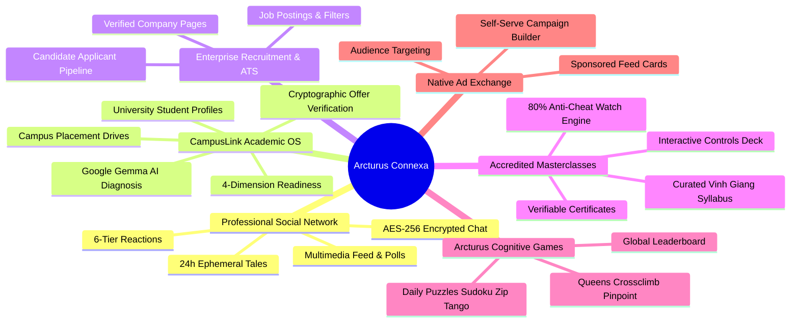

# Project Overview & Architectural Explanation
## Arcturus Connexa: The Unified Professional, Academic & Enterprise Operating System
**Document Version:** 2.4.0  
**Repository:** `AlienMinus/Arcturus-Connexa`  
**Classification:** Complete Project Technical Overview & Comprehensive Guide  

---

## 1. Executive Summary & Philosophy

### 1.1 What is Arcturus Connexa?
**Arcturus Connexa** (commonly called **Arcturus**) is an all-in-one digital platform that unifies six traditionally disconnected career systems into one coherent, high-trust digital ecosystem:



### 1.2 The Core Problem Arcturus Solves
Before Arcturus, users navigated fragmented platforms with broken transitions:
1. **Professional Identity Silo:** Traditional business networks focus on established executives and general networking, largely ignoring on-campus college placement drives and academic eligibility cutoffs.
2. **Academic Placement Silo:** College placement portals (e.g., Superset) operate as closed, clunky databases disconnected from real-world portfolios and professional networking.
3. **E-Learning Accreditation Gap:** Many online courses award completion certificates for merely scrubbing the progress bar to 100%, destroying trust in online credentialing.
4. **Corporate Document Fraud:** Fake company accounts and fraudulent recruitment postings proliferate when platforms lack rigorous corporate document verification.

Arcturus bridges these gaps with a single authenticated identity, an anti-cheat learning engine, corporate legal document verification, and a dedicated higher-education placement engine.

---

## 2. Deep Dive: Architectural Pillars & Subsystems

---

### Pillar 1: Professional Social Network & Activity Stream
- **Feed Engine (`src/components/Home/Feed/`):**
  - Renders an infinite, responsive activity stream supporting text, photos, videos, interactive polls, event schedules, celebration badges, and attached PDF/documents.
  - Social interactions feature a 6-tier reaction system (`like`, `celebrate`, `support`, `love`, `insightful`, `funny`) and multi-level nested comment threads.
- **Search & Discovery (`src/pages/SearchPage/`):**
  - Unified search box with real-time suggestions across users, job postings, masterclasses, and registered organizations.
  - On mobile devices, the search box cleanly collapses into an icon and expands full-width with a dismiss button.

---

### Pillar 2: Ephemeral Tales (Stories Engine)
- **24-Hour Ephemeral Lifecycle (`server/models/Tale.js`):**
  - Enables users to post quick video or image updates with text stickers.
  - Protected by a MongoDB TTL index that automatically deletes tale documents 86,400 seconds after creation.
  - Tracks individual viewers with timestamps and allows direct inline private replies.

---

### Pillar 3: End-to-End Encrypted Direct Messaging
- **Database-Level AES-256-CBC Encryption (`server/models/Message.js`):**
  - Every private message is encrypted at rest using an AES-256-CBC cipher with a unique 16-byte initialization vector (IV) generated per message.
  - Format in MongoDB: `<hex_iv>:<hex_ciphertext>`.
  - Mongoose transparently encrypts upon writing (`set: encrypt`) and decrypts upon querying (`get: decrypt`), ensuring sensitive career conversations remain secure even if database snapshots are inspected.

---

### Pillar 4: Multi-Tenant Enterprise Hub & Document Verification
- **Verified Organizations (`server/models/Organization.js`):**
  - Self-serve company page creation with role-based member management (`Admin`, `Recruiter`, `Placement Officer`, `Member`).
  - **Mandatory Corporate Document Audit:**
    - Organizations must upload official verification documents (Certificate of Incorporation, Business License, or Tax ID / GST).
    - Submissions enter a `pending` state visible only to Super Administrators.
    - Super Admins inspect documents in a high-resolution modal Lightbox.
    - Upon approval, the company receives a verified badge. If rejected, administrators provide feedback from preset reasons, allowing recruiters to fix and re-submit their documents seamlessly.

---

### Pillar 5: CampusLink — Academic Placement & Career Engine
- **Targeted Higher-Education Career OS (`server/routes/campuslink/`):**
  - **Student Placement Profiles:** Tracks college, roll number, engineering major, cumulative CGPA, active backlogs, and resumes.
  - **4-Dimension Readiness Matrix:**
    $$\text{Overall Readiness} = 0.35 \times \text{Tech} + 0.25 \times \text{Aptitude} + 0.20 \times \text{Comm} + 0.20 \times \text{Project}$$
  - **Google Gemma 3 AI Diagnostics:** Integrates `google/gemma-3-4b-it` via Hugging Face Inference to analyze weak dimensions, predict at-risk students, and generate remedial learning plans.
  - **Campus Placement Drives:** Recruiter portal allows companies to set automated cutoffs (e.g., $\text{CGPA} \ge 7.5$, $0$ active backlogs, allowed branches).
  - **Cryptographic Offer Verification:** Generates an immutable SHA-256 verification hash for all issued offers to eliminate counterfeit placement claims.

---

### Pillar 6: Enterprise Recruitment & Applicant Tracking System (ATS)
- **Job Portal (`src/pages/JobsPage/`, `src/pages/JobPostingPage/`):**
  - Employers can post open positions with criteria including Workplace Type (`On-site`, `Hybrid`, `Remote`), Employment Type (`Full-time`, `Internship`, etc.), and compensation ranges.
  - Candidates apply with one click using their verified Arcturus profile.
  - Recruiters track candidate progress through applicant stages: `Applied` $\rightarrow$ `In Review` $\rightarrow$ `Shortlisted` $\rightarrow$ `Rejected` $\rightarrow$ `Hired`.

---

### Pillar 7: Learning Hub — Accreditation-Grade Masterclasses
- **Vinh Giang Communication Curriculum (`src/pages/Learning/LearningHubPage.jsx`):**
  - Features curated video masterclasses covering vocal mastery, conversation storytelling, executive influence, and clear explaining frameworks.
- **Strict Anti-Cheat Verification Engine:**
  - Integrates the YouTube IFrame API with custom playback controls.
  - Tracks **unique seconds of active playback** via an in-memory set accumulator.
  - Fast-forwarding or skipping to the end **does not** advance verified completion.
  - Learners must watch **$\ge 80\%$ genuine watch time** before the "Complete Lesson" action unlocks.
  - Completing all lessons mints a verifiable digital accreditation certificate.

---

### Pillar 8: Cognitive Brain Training (Arcturus Games)
- **Daily Mini-Games Suite (`src/pages/HomePage/` & `server/routes/games.js`):**
  - Six daily brain puzzles: Sudoku, Zip, Tango, Queens, Crossclimb, and Pinpoint.
  - Tracks daily completion streaks, move counters, and completion times on a global competitive leaderboard.

---

### Pillar 9: Native Targeted Ad Exchange (Arcturus Ads)
- **Self-Serve Marketing Suite (`src/pages/AdvertisePage/` & `server/routes/ads.js`):**
  - Allows businesses to launch campaigns targeting specific industries, regions, and placement slots (`feed`, `sidebar`, `both`).
  - Tracks impressions, interactive clicks, and daily budget pacing.
  - Provides a Google AdSense fallback slot with width guardrails ($\ge 250\text{px}$) to prevent tag errors on narrow viewports.

---

### Pillar 10: Operations Hub (Super Administrator Dashboard)
- **Administrative Command Center (`src/pages/admin/AdminDashboard.jsx`):**
  - Accessible strictly to users with `role: admin` or `isAdmin: true`.
  - **Live Metrics Deck:** Real-time counters for Organizations, Verification Requests, Active Jobs, Users, Masterclasses, and Learners.
  - **Document Lightbox & Rejection Console:** High-resolution preview of submitted corporate legal documents with preset rejection chips.
  - **Masterclasses CMS:** Full CRUD management for courses, curriculum modules, lesson sequencing, duration calculation, and YouTube URL sanitization.

---

## 3. Technology Stack & Implementation Details

```mermaid
flowchart TD
    subgraph Frontend Architecture
        React[React 19.x]
        Vite[Vite 7.x Bundler]
        RR7[React Router v7]
        Context[Auth & Theme Contexts]
        CSS[Modular CSS + darkmode.css + mobile.css]
    end

    subgraph Backend Architecture
        Node[Node.js 20+ ES Modules]
        Express[Express.js 4.x]
        Mongoose[Mongoose 8.x ODM]
        JWT[JSON Web Tokens]
        Crypto[crypto AES-256-CBC]
        Bcrypt[bcryptjs 10 Rounds]
    end

    subgraph Cloud Infrastructure
        MongoAtlas[(MongoDB Atlas)]
        CloudinaryCDN[Cloudinary CDN]
        VercelEdge[Vercel Frontend]
        RenderServer[Render Backend]
    end

    Frontend Architecture --> Backend Architecture
    Backend Architecture --> CloudInfrastructure
```

---

## 4. Local Development & Installation Guide

### 4.1 Prerequisites
- **Node.js:** v20.x or higher installed.
- **Package Manager:** `npm` v10+.
- **MongoDB:** Active MongoDB Atlas cluster URI or local MongoDB instance.
- **Git:** Git version control.

### 4.2 Installation Steps

1. **Clone the Repository:**
   ```bash
   git clone https://github.com/AlienMinus/Arcturus-Connexa.git
   cd Arcturus-Connexa/arcturus
   ```

2. **Backend Environment Setup:**
   Create `server/.env`:
   ```ini
   PORT=3000
   MONGODB_URI=mongodb+srv://<username>:<password>@cluster.mongodb.net/arcturus
   JWT_SECRET=your_super_secret_jwt_key_here
   ENCRYPTION_KEY=12345678901234567890123456789012
   CLOUDINARY_CLOUD_NAME=your_cloud_name
   CLOUDINARY_API_KEY=your_cloudinary_key
   CLOUDINARY_API_SECRET=your_cloudinary_secret
   SMTP_HOST=smtp.gmail.com
   SMTP_PORT=587
   SMTP_USER=your_email@gmail.com
   SMTP_PASS=your_app_password
   ```

3. **Install Dependencies:**
   ```bash
   # Install client dependencies
   npm install

   # Install server dependencies
   cd server
   npm install
   cd ..
   ```

4. **Verify Build & Run Application:**
   ```bash
   # Verify client build
   npm run build

   # Start backend API (Port 3000)
   cd server
   node server.js

   # Start frontend Vite development server (Port 5173)
   npm run dev
   ```

---

## 5. Future Roadmap & Platform Evolution

1. **WebRTC 1-on-1 Video Interview Rooms:** Integrating direct browser-to-browser WebRTC video calls inside CampusLink for remote placement rounds.
2. **AI Resume Screening & Score Card:** Automatically parsing uploaded PDF resumes using LLM embedding models to generate fit scores against job requirements.
3. **Automated Proctoring for Campus Tests:** Browser lockdown and webcam monitoring during online aptitude rounds within CampusLink.
4. **Mobile App Native Builds:** Packaging the responsive React SPA as an iOS and Android app via Capacitor/React Native.

