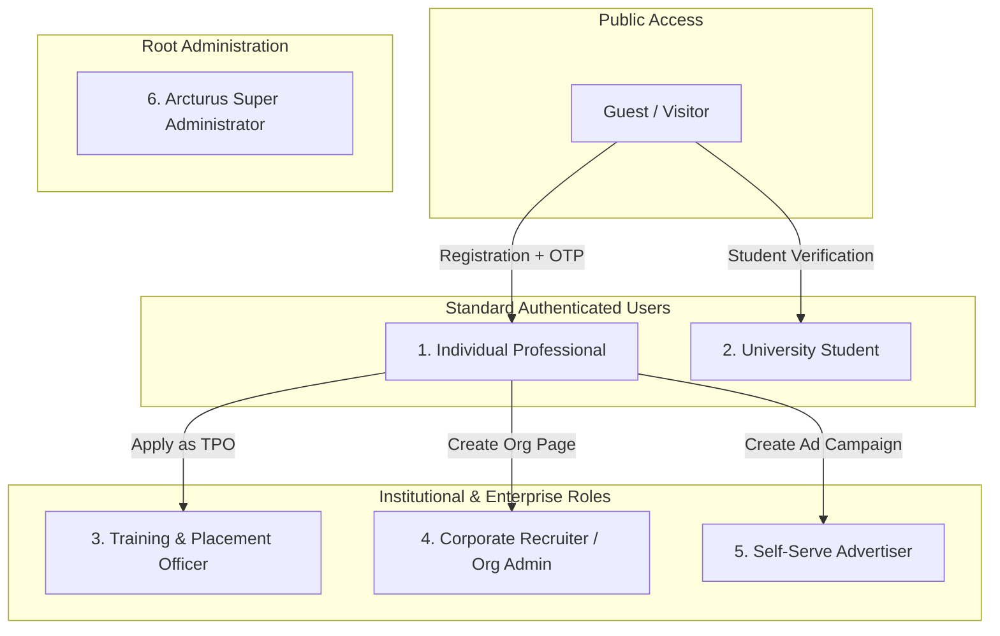
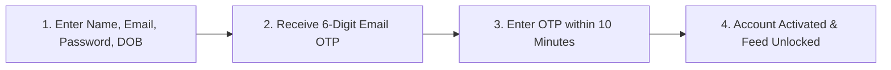
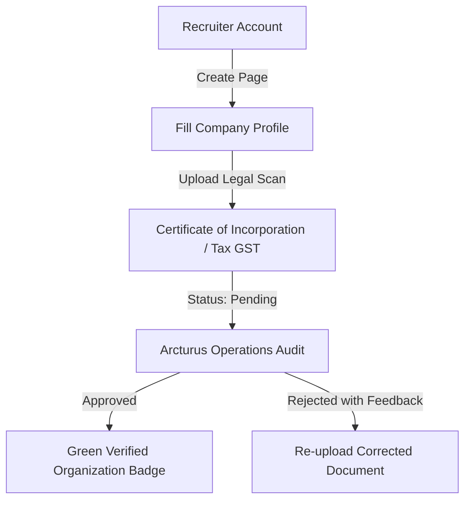
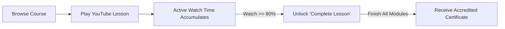

# User Manual & Onboarding Guide
## Arcturus Connexa: Comprehensive User Manual by Account Type
**Document Version:** 2.4.0  
**Target Audience:** All Arcturus Users, Academic Personnel, Recruiters, and Administrators  

---

## 1. Welcome to Arcturus Connexa

**Arcturus Connexa** is an integrated professional network, enterprise talent marketplace, academic placement engine, and accredited masterclass platform. This manual details the registration, verification, and day-to-day operations for all six platform roles.

---

## 2. User Roles & Permissions Matrix

| User Type | Who It Is | Key Capabilities | Verification Requirement |
| :--- | :--- | :--- | :--- |
| **Individual Professional** | Working professionals, freelancers, job seekers | Feed, posts, messaging, networking, jobs, masterclasses, games | 6-digit Email OTP |
| **University Student** | Enrolled undergraduate/postgraduate students | All standard features + CampusLink drives, Gemma AI readiness analysis | Email OTP + Academic Roll Number |
| **Placement Officer (TPO)** | University faculty & placement cell administrators | Manage campus placement drives, verify student profiles, audit offer letters | Institutional verification review |
| **Corporate Recruiter** | HR managers, founders, talent acquisition teams | Post enterprise jobs, review applicant resumes, schedule campus drives | Corporate document verification |
| **Advertiser** | Marketers, brand managers, business owners | Build sponsored feed and sidebar campaigns, track impressions and clicks | Valid payment / active campaign budget |
| **Super Administrator** | Platform compliance officers & system operators | Platform oversight, document lightbox audit, course CMS, user moderation | Root server credentials (`role: admin`) |

---

## 3. Registration & Onboarding Workflows

---

### 3.1 Individual Professional Registration (Standard)

1. **Navigate to Registration:**
   - Open Arcturus and click **Join Now** or navigate to `/login` and switch to the **Sign Up** tab.
2. **Submit Credentials:**
   - Enter **First Name**, **Last Name**, **Email Address**, **Password** ($\ge 8$ characters recommended), and **Date of Birth** (must be $\ge 16$ years old).
   - Click **Create Account**.
3. **Email OTP Verification:**
   - A 6-digit numeric OTP will be automatically dispatched to your inbox.
   - Enter the code in the verification modal within **10 minutes**.
   - *Tip:* If the code does not arrive within 60 seconds, click **Resend OTP** (check your Spam/Junk folder if necessary).
4. **Complete Profile:**
   - Add a profile photo, headline (e.g., *Full Stack Engineer at TechCorp*), location, and summary bio.

---

### 3.2 Student Onboarding & CampusLink Activation

1. **Sign in** with an existing Arcturus account.
2. Navigate to **CampusLink** via the top navigation bar (`/campuslink`).
3. Click **Activate Student Profile**.
4. **Enter Academic Information:**
   - **University / College Name**: Select or enter your registered institution.
   - **Roll Number / Student ID**: Enter your official university roll number.
   - **Branch / Major**: Select your engineering or academic discipline (e.g., *Computer Science & Engineering*).
   - **Graduation Year**: Select expected passing year.
   - **Current CGPA**: Enter your cumulative grade score ($0.0 - 10.0$).
   - **Active Backlogs**: Declare any pending backlogs (honesty is required; verified by TPO).
5. **Compute Employability Score:**
   - The platform calculates your **4-Dimension Readiness Breakdown** across Technical, Aptitude, Communication, and Project competencies.
   - Receive tailored remedial diagnostics generated by Google Gemma AI (`google/gemma-3-4b-it`).

---

### 3.3 Training & Placement Officer (TPO) Registration

1. Register a standard account using your **official institutional email address** (e.g., `officer@university.edu`).
2. Navigate to **Settings** $\rightarrow$ **Campus Placement Officer Application**.
3. **Submit Verification Details:**
   - Official Designation (e.g., *Head of Training & Placements*).
   - University / Institution Name.
   - Attached proof of appointment (Faculty ID or official authorization letter).
4. **Review Period:**
   - Arcturus Operations evaluates the application within **24 hours**.
   - Upon approval, your account status switches to `placementOfficer.status: 'approved'`, unlocking the **TPO Management Console**.

---

### 3.4 Corporate Organization Registration & Business Verification

1. Log in and navigate to **For Business** $\rightarrow$ **Create Organization Page**.
2. **Company Profile Setup:**
   - Company Name (must match corporate registration papers).
   - Industry (e.g., *Financial Technology*, *Cloud Computing*).
   - Headcount Size (e.g., *51-200 employees*).
   - Company Website URL and Headquarters Location.
3. **Legal Document Upload (Mandatory for Verification):**
   - Click **Add Verification Document**.
   - Select document type:
     - *Certificate of Incorporation*
     - *Business License*
     - *Tax ID / Registration (GST, VAT, EIN)*
   - Upload a clear PDF scan or high-resolution PNG/JPEG image.
4. **Audit Lifecycle:**
   - Submission enters `pending` status.
   - Arcturus Administrators review the document in the Operations Hub Lightbox.
   - Once verified, the company receives a verified badge and unlocks unlimited job postings and campus drive scheduling.

---

### 3.5 Super Administrator Access

- Super Administrator privileges are restricted to internal platform operators with `role: admin` or `isAdmin: true`.
- Accessible directly via the **Operations Hub** route at `/admin`.
- Super Admins manage platform metrics, approve/reject pending business registrations, moderate jobs, and curate masterclass course syllabi.

---

## 4. End-User Feature Guides

---

### 4.1 Professional Feed & Multimedia Posting
- **Creating a Post:**
  - Click **Start a post** on the home feed.
  - Choose content type:
    - 📷 **Photo / Video:** Upload files directly to Cloudinary.
    - 📊 **Poll:** Set custom questions, options, and expiration.
    - 📄 **Document:** Attach resumes, whitepapers, or slide decks.
    - 🎉 **Celebration:** Give kudos, celebrate promotions, or welcome colleagues.
    - 💼 **Hiring:** Announce an open position directly to your network.
  - Set audience visibility: `Anyone` (Public) or `Connections only`.

---

### 4.2 Ephemeral Tales (24-Hour Stories)
- **Posting a Tale:**
  - On the left sidebar, click **Your Tale (+)**.
  - Upload an image or record a video. Add custom text overlay captions.
  - Tales automatically disappear after **24 hours** via MongoDB TTL indexes.
- **Viewing Tales:**
  - Click any connection's circular avatar ring at the top of the feed to watch their stories.
  - See real-time viewer lists and send instant emoji reactions or private replies.

---

### 4.3 Direct Messaging
- Navigate to **Messaging** (`/messaging`).
- Select any mutual connection to initiate a chat.
- **Security Assurance:** Every character typed is encrypted using **AES-256-CBC** before being written to disk. Only you and the recipient possess the decryption capability.

---

### 4.4 Learning Hub & Communication Masterclasses

1. Navigate to **Learning** (`/learning`).
2. Select any communication masterclass from Vinh Giang (`@askvinh`):
   - *The Art of Communication: Vocal Mastery*
   - *Effortless Conversation & Subtext Listening*
   - *Executive Influence & Difficult Conversations*
   - *The CLEAR Explaining Framework*
3. **Meeting the Anti-Cheat Requirement:**
   - Watch the lecture using the built-in controls (Play, Pause, Speed adjustment).
   - **Crucial:** You must actively watch **at least 80% of the genuine video duration**. Fast-forwarding or skipping to the end will **not** satisfy the verified watch-time counter.
   - Once the dual-track progress bar turns emerald ($\ge 80\%$), the **Complete Lesson** button unlocks.
   - Upon completing all modules, your digital certificate with a verifiable verification ID is minted.

---

### 4.5 CampusLink for Placement Officers (TPO Console)
1. Navigate to **CampusLink** $\rightarrow$ **TPO Console**.
2. **Schedule a New Drive:**
   - Enter Company Name, Role, Package CTC (LPA), and Stipend.
   - Define Cutoffs: Minimum CGPA, maximum allowed backlogs, and eligible engineering branches.
   - Configure Rounds: Pre-Placement Talk, Aptitude Test, Technical Interview, HR Round.
3. **Monitor Candidate Pipeline:**
   - Filter applicants who meet cutoffs automatically.
   - Advance candidates through interview stages: `applied` $\rightarrow$ `shortlisted` $\rightarrow$ `in_interview` $\rightarrow$ `selected`.
4. **Issue & Audit Offers:**
   - Record issued offer letters with compensation packages and joining dates.
   - The platform mints an immutable SHA-256 verification hash to prevent fraudulent placement claims.

---

### 4.6 Operations Hub for Super Administrators (`/admin`)

1. **Dashboard Overview:**
   - Real-time KPI deck showing Total Organizations, Verification Requests, Active Jobs, Users, Masterclasses, and Learners.
2. **Organization Verification Lightbox:**
   - Open pending company registration cards.
   - Click document thumbnails to inspect high-resolution scans in the built-in Lightbox.
   - Click **Approve** to verify or **Reject** to select a feedback reason preset (e.g., *Illegible document image*).
3. **Course Management CMS:**
   - Click the **Masterclasses** tab (`/admin`).
   - Click **+ Create Course** to launch the two-tab Course Editor Modal.
   - **Tab 1:** Metadata, instructor profile, thumbnail preview.
   - **Tab 2:** Interactive curriculum builder to add modules, reorder lessons, sanitize YouTube links, and set lesson summaries.

---

## 5. Frequently Asked Questions (FAQs) & Troubleshooting

### Q1: I did not receive my registration OTP. What should I do?
- Check your email's **Spam** and **Promotions** folders.
- Ensure your email was entered accurately.
- Wait 60 seconds and click **Resend OTP**. OTP codes expire after exactly 10 minutes.

### Q2: Why is the "Complete Lesson" button disabled in the Learning Hub?
- The Learning Hub enforces accreditation anti-cheat standards.
- You must actively watch at least **80% of the genuine lecture duration**. Fast-forwarding or jumping to the end of the video does not count toward verified playback.

### Q3: Why was my organization registration rejected?
- Review the specific feedback message in your organization settings. Common reasons include:
  1. Illegible or blurry document scans.
  2. The company name on the registration form does not match the legal name on the certificate.
  3. Uploaded business license has expired.
- Re-upload a high-resolution scan to automatically re-submit for review.

